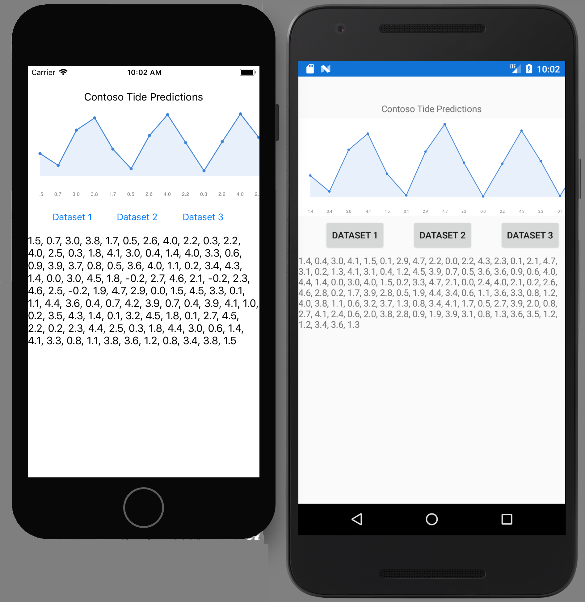

# ContosoTides
On-Device Mobile Inferencing Using CoreML, Tensorflow Android Inference, and Xamarin.Forms

This is an example program showing the delivery of a Tensorflow-trained LSTM on both iOS, using CoreML, and Android, using Tensorflow Android Inference. 

This Visual Studio for Mac solution contains all necessary files, including the trained ML model and Xamarin binding project for Tensorflow Android Inference. The binding project used by the sample is located in this repo under `TensorFlowXamarin/` but developers interested in the latest version of the binding should refer to the [Tensorflow.Xamarin.Android dedicated repository](https://github.com/lobrien/TensorFlow.Xamarin.Android).

The `/training` directory contains data and Python sources for recreating the model and converting/saving the Keras code into CoreML and Tensorflow protobuf format. 

